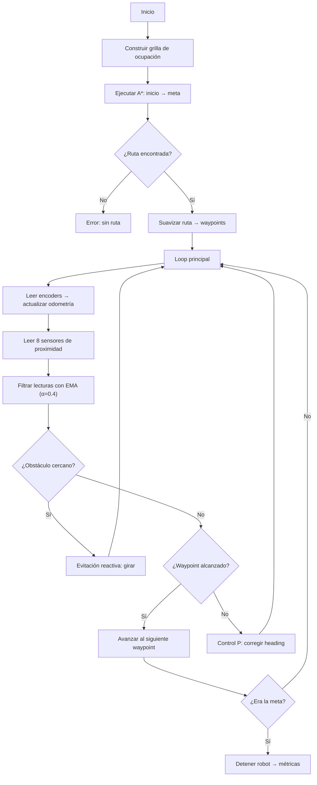

# Proyecto Final: Navegación Autónoma con Planificación de Rutas (A*) en Webots

**Asignatura:** ICI 4150 — Robótica y Sistemas Autónomos 2026-01  
**Línea seleccionada:** Línea A — Planificación de Rutas  

## Integrantes

| Nombre           |
| ---------------- |
| Martín Cevallos  |
| Carlos Abarza    |
| Matías Vergara   |

## Objetivo

Diseñar, implementar y evaluar un sistema de navegación autónoma para un robot móvil diferencial (**e-puck**) en Webots, que integra:

- Control cinemático diferencial (Lab 1)
- Percepción sensorial y estimación de movimiento con encoders (Lab 2)
- Planificación global de rutas con el algoritmo **A\*** sobre una grilla de ocupación 2D
- Navegación reactiva para evitación de obstáculos en tiempo real

El robot debe desplazarse de forma autónoma desde una posición inicial hasta una meta en un entorno con obstáculos, siguiendo la ruta planificada y evitando colisiones.

---

## Descripción del Robot

### Robot e-puck

| Parámetro               | Valor               |
| ------------------------ | ------------------- |
| Modelo                   | e-puck              |
| Tipo de locomoción       | Diferencial (2 ruedas) |
| Radio de rueda           | 0.0205 m            |
| Distancia entre ruedas   | 0.052 m             |
| Radio del robot          | ~0.037 m            |
| Velocidad máxima motores | 6.28 rad/s          |

### Sensores utilizados

| Sensor                | Dispositivo Webots        | Función                              |
| --------------------- | ------------------------- | ------------------------------------ |
| Proximidad frontal-der | `ps0`                    | Detectar obstáculos al frente        |
| Proximidad der-frontal | `ps1`                    | Detectar obstáculos laterales-frente |
| Proximidad derecho     | `ps2`                    | Detectar obstáculos laterales        |
| Proximidad der-trasero | `ps3`                    | Cobertura trasera                    |
| Proximidad izq-trasero | `ps4`                    | Cobertura trasera                    |
| Proximidad izquierdo   | `ps5`                    | Detectar obstáculos laterales        |
| Proximidad izq-frontal | `ps6`                    | Detectar obstáculos laterales-frente |
| Proximidad frontal-izq | `ps7`                    | Detectar obstáculos al frente        |
| Encoder izquierdo      | `left wheel sensor`      | Estimar desplazamiento               |
| Encoder derecho        | `right wheel sensor`     | Estimar desplazamiento               |

### Actuadores

| Actuador       | Dispositivo Webots     | Función            |
| -------------- | ---------------------- | ------------------ |
| Motor izquierdo | `left wheel motor`    | Tracción izquierda |
| Motor derecho   | `right wheel motor`   | Tracción derecha   |

---

## Descripción de los Escenarios de Prueba

### Escenario Simple

- **Arena:** 2 m × 2 m
- **Obstáculos:** 5 bloques dispersos de diferentes tamaños
- **Inicio:** (-0.75, -0.75) — marcado con disco azul
- **Meta:** (0.75, 0.75) — marcado con disco verde
- **Dificultad:** Baja. Ruta relativamente directa con desvíos menores.

### Escenario Complejo

- **Arena:** 2 m × 2 m
- **Obstáculos:** 12 elementos — 4 muros horizontales que fuerzan un patrón zigzag + 4 bloques que estrechan los corredores + 4 bloques decorativos
- **Inicio:** (-0.75, -0.75)
- **Meta:** (0.75, 0.75)
- **Dificultad:** Alta. El robot debe navegar un zigzag con corredores estrechos.

---

## Algoritmo Implementado: A* sobre Grilla de Ocupación

### Grilla de Ocupación

El entorno se discretiza en una **grilla de 40×40 celdas** (resolución: 5 cm/celda). Los obstáculos se representan como celdas ocupadas, con una **inflación de 1 celda** (~5 cm) para compensar el radio del robot y proveer un margen de seguridad.

### Algoritmo A*

- **Tipo:** Búsqueda informada sobre grafos
- **Nodos:** Celdas de la grilla (fila, columna)
- **Movimiento:** 8 direcciones (4 cardinales + 4 diagonales)
- **Costo:** 1.0 para movimiento cardinal, √2 para diagonal
- **Heurística:** Distancia euclídea (admisible y consistente)
- **Anti-corner-cutting:** Se prohíbe el movimiento diagonal cuando una celda adyacente está ocupada
- **Suavizado:** Reducción de waypoints mediante verificación de línea de visión (Bresenham)

### Navegación con Control Proporcional

Una vez obtenida la ruta (lista de waypoints), el robot los sigue usando **control proporcional de heading**:

```
error_heading = heading_deseado − heading_actual
ω = Kp · error_heading
v_izq = v_base − ω · L / (2·R)
v_der = v_base + ω · L / (2·R)
```

Parámetros:
- `Kp = 3.0` (ganancia proporcional)
- `v_base = 3.14 rad/s` (velocidad base de motores)
- Umbral de waypoint: 8 cm
- Umbral de meta: 4 cm

### Evitación Reactiva de Obstáculos

Cuando los sensores (filtrados con EMA, α=0.4) detectan un obstáculo cercano, el sistema de evitación **tiene prioridad sobre el seguimiento de ruta**. Se usan los 8 sensores para clasificar el nivel de amenaza:

| Nivel      | Valor crudo | Acción                                |
| ---------- | ----------- | ------------------------------------- |
| Detección  | > 100       | Arco suave (avanza girando)           |
| Crítico    | > 250       | Giro en el lugar                      |
| Peligro    | > 500       | Retrocede girando (emergencia, 1.6 s) |

La dirección de giro se decide comparando la suma de los 4 sensores izquierdos (ps4–ps7) vs los 4 derechos (ps0–ps3): se gira hacia el lado con menos obstáculos.

---

## Diagrama de Flujo



---

## Relación con los Laboratorios 1 y 2

### Laboratorio 1 — Control Cinemático Diferencial

Del Lab 1 se reutiliza directamente el **modelo cinemático diferencial** para el control de movimiento:

```
v = (v_r + v_l) / 2          # velocidad lineal
ω = (v_r − v_l) / L          # velocidad angular
```

El proyecto extiende esto agregando un **controlador proporcional** que calcula las velocidades de cada rueda para seguir waypoints, en lugar de ejecutar movimientos predefinidos.

### Laboratorio 2 — Percepción y Estimación

Del Lab 2 se integran:

- **Lectura de sensores de proximidad** (ps0–ps7) para detección de obstáculos
- **Filtro EMA** (Exponential Moving Average, α=0.4) aplicado a las lecturas de los 8 sensores para suavizar ruido y evitar falsos positivos en la evasión reactiva
- **Encoders de rueda** para estimación de desplazamiento por odometría
- **Navegación reactiva** como capa de seguridad: el sistema de evitación de obstáculos del Lab 2 se adapta como complemento a la planificación global con A*

Las ecuaciones de odometría utilizadas son las mismas del Lab 1/2:

```
Δs_r = r · Δθ_r          Δs_l = r · Δθ_l
Δs   = (Δs_r + Δs_l) / 2
Δφ   = (Δs_r − Δs_l) / L
x_k  = x_{k-1} + Δs · cos(φ_{k-1} + Δφ/2)
z_k  = z_{k-1} − Δs · sin(φ_{k-1} + Δφ/2)
φ_k  = φ_{k-1} + Δφ
```

---

## Resultados Obtenidos

> **Nota:** Los valores se actualizarán tras ejecutar la simulación.

### Escenario Simple

| Métrica                        | Valor   |
| ------------------------------ | ------- |
| Meta alcanzada                 | Sí      |
| Tiempo total                   | 79.3 s  |
| Longitud ruta planificada      | 2.196 m |
| Longitud trayectoria ejecutada | 2.311 m |
| Diferencia plan/real           | 0.115 m |
| Error final de posición        | 0.039 m |
| Casi-colisiones                | 26      |

### Escenario Complejo

| Métrica                        | Valor   |
| ------------------------------ | ------- |
| Meta alcanzada                 | Sí      |
| Tiempo total                   | 106.6 s |
| Longitud ruta planificada      | 2.438 m |
| Longitud trayectoria ejecutada | 2.618 m |
| Diferencia plan/real           | 0.180 m |
| Error final de posición        | 0.039 m |
| Casi-colisiones                | 28      |

### Gráficos

Los gráficos se generan automáticamente al ejecutar la simulación (o con `plot_results.py`):

1. **Grilla + ruta A***: Muestra la grilla de ocupación con la ruta planificada
2. **Planificada vs real**: Compara la ruta planificada con la trayectoria ejecutada
3. **Sensores**: Lecturas de sensores de proximidad durante la navegación
4. **Heading + acciones**: Orientación del robot y acciones tomadas en el tiempo

---

## Instrucciones para Ejecutar la Simulación

### Requisitos

- [Webots R2025a](https://cyberbotics.com/) instalado
- Python 3 (incluido con Webots)
- `matplotlib` (opcional, para generación automática de gráficos)

### Pasos

1. **Abrir Webots**
2. Ir a `File → Open World...`
3. Seleccionar uno de los mundos:
   - `worlds/proyecto_final_simple.wbt` — Escenario simple
   - `worlds/proyecto_final_complejo.wbt` — Escenario complejo
4. La simulación **inicia automáticamente**:
   - El controlador construye la grilla, ejecuta A* y muestra la ruta en consola
   - El robot navega hacia la meta
   - Al finalizar, se imprimen métricas y se generan gráficos
5. Observar la **consola de Webots** para ver el progreso y los resultados

### Generar gráficos manualmente

Si `matplotlib` no está disponible en el entorno de Webots:

```bash
cd controllers/proyecto_final_controller/
python3 plot_results.py simple
python3 plot_results.py complejo
```

---

## Conclusiones

1. **Integración exitosa de los laboratorios:** El proyecto unifica el control cinemático diferencial (Lab 1) con la percepción sensorial y estimación por encoders (Lab 2) en un sistema de navegación autónoma completo.

2. **A\* como planificador global:** El algoritmo A* sobre la grilla de ocupación proporciona rutas óptimas y evita las limitaciones de la navegación puramente reactiva (ej.: quedar atrapado en mínimos locales).

3. **Arquitectura de dos capas:** La combinación de planificación global (A*) con evitación reactiva local (sensores) permite manejar tanto la estrategia de alto nivel como las correcciones en tiempo real.

### Limitaciones

- **Error odométrico acumulativo:** La estimación por encoders acumula error con el tiempo, especialmente en giros. En trayectorias largas (escenario complejo), la posición estimada puede diferir significativamente de la real.
- **Grilla estática:** El mapa es predefinido. Si un obstáculo no previsto aparece, el robot depende exclusivamente de la evitación reactiva.
- **Rango de sensores IR:** Los sensores de proximidad del e-puck tienen un rango limitado (~5 cm), lo que reduce el tiempo de reacción ante obstáculos.
- **Resolución de la grilla:** Con celdas de 5 cm, corredores estrechos pueden quedar completamente bloqueados tras la inflación.

### Posibles Mejoras

- Implementar un **Filtro de Kalman Extendido (EKF)** para fusionar odometría con sensores y reducir el error acumulativo (extensión del Lab 2).
- Usar un **LiDAR** para aumentar el rango de detección.
- Implementar **replanificación dinámica** (D* Lite) para actualizar la ruta cuando se detectan obstáculos inesperados.
- Adaptar la grilla en tiempo real para lograr un sistema cercano a SLAM.
- Añadir un **controlador PID** en lugar de solo proporcional para mejorar la precisión del seguimiento de ruta.

---

## Video Demostrativo

> Agregar enlace o archivo de video tras grabar la demostración en Webots.

---

## Estructura del Proyecto

```
Robotica-traajo/
├── README.md                                     ← Este archivo (informe)
├── ProyectoFinal.pdf                             ← Enunciado del proyecto
├── worlds/
│   ├── laboratorio1.wbt                          ← Mundo Lab 1
│   ├── proyecto_final_simple.wbt                 ← Escenario simple
│   └── proyecto_final_complejo.wbt               ← Escenario complejo
├── controllers/
│   ├── lab1_controller/
│   │   └── lab1_controller.py                    ← Controlador Lab 1
│   └── proyecto_final_controller/
│       ├── proyecto_final_controller.py           ← Controlador principal
│       └── plot_results.py                        ← Generador de gráficos
└── video/                                         ← Videos demostrativos
```

## Herramientas

- **Webots R2025a** — Simulador de robots
- **Python 3** — Lenguaje del controlador
- **matplotlib** — Generación de gráficos
- **Algoritmo A\*** — Planificación de rutas
