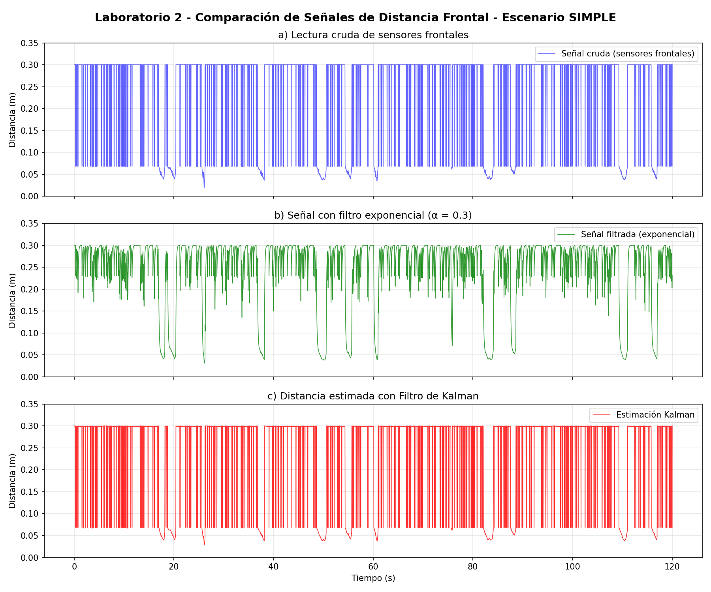
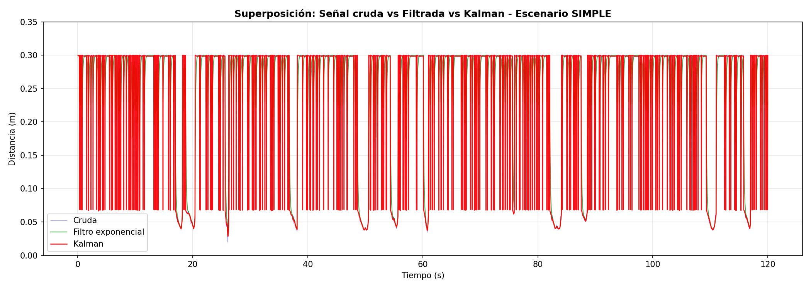
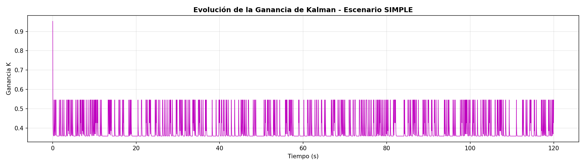
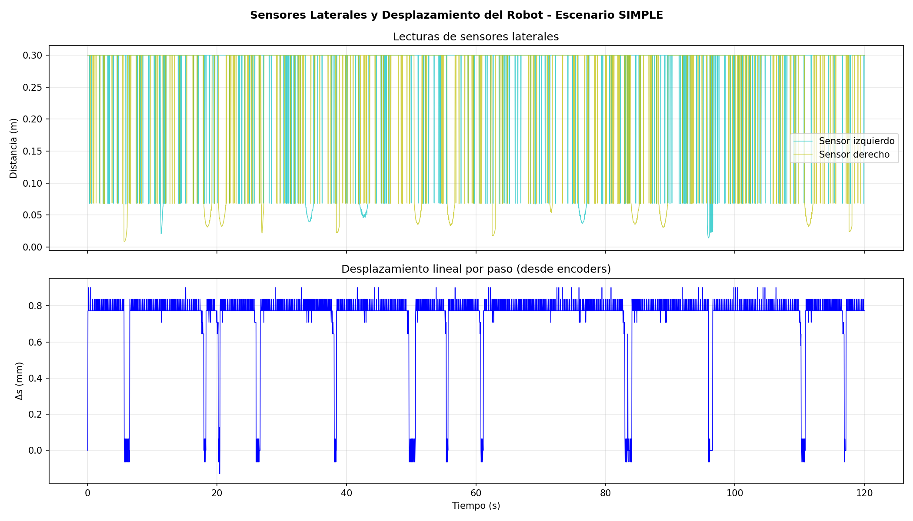
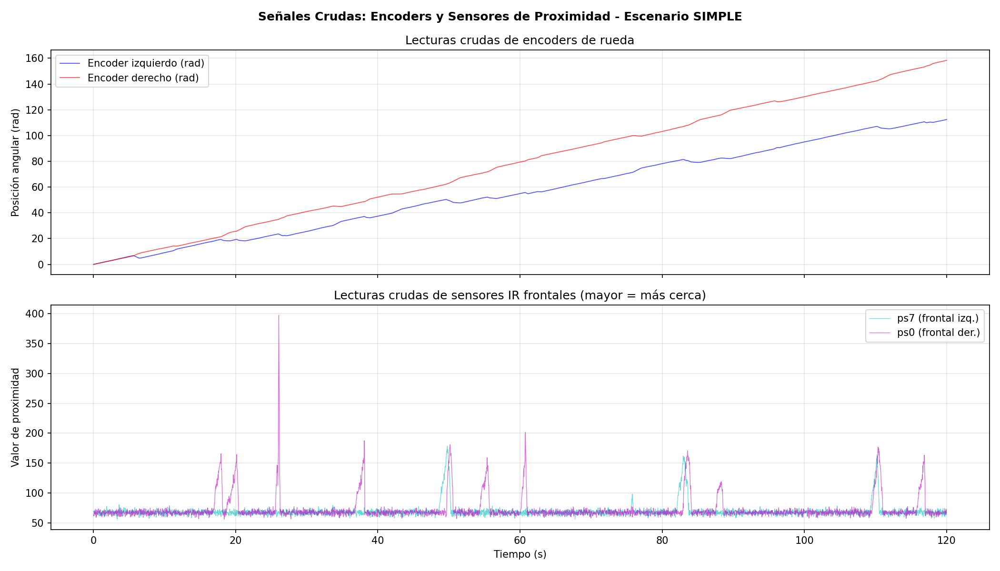
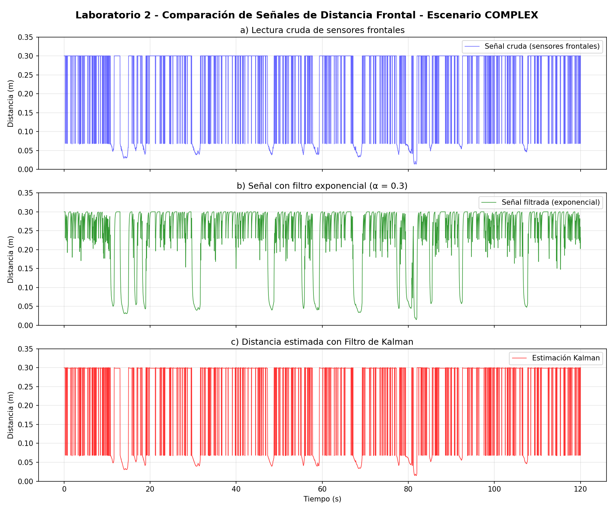
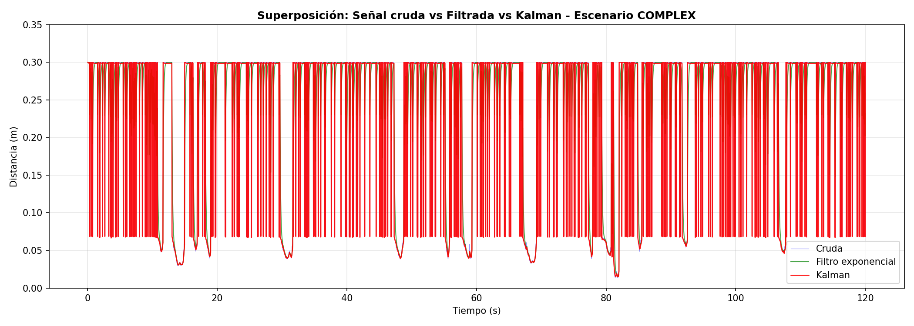
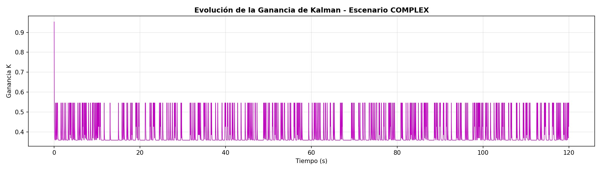
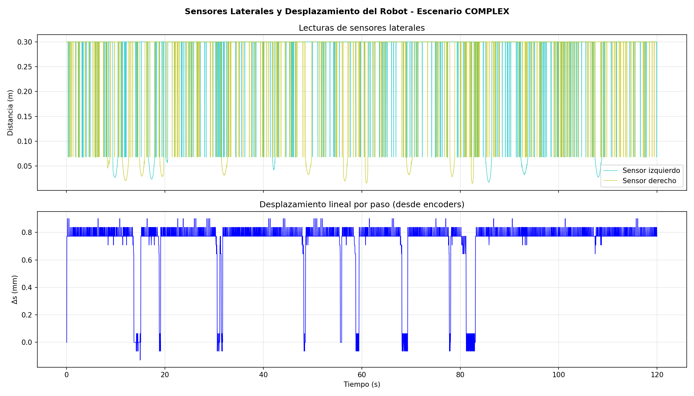
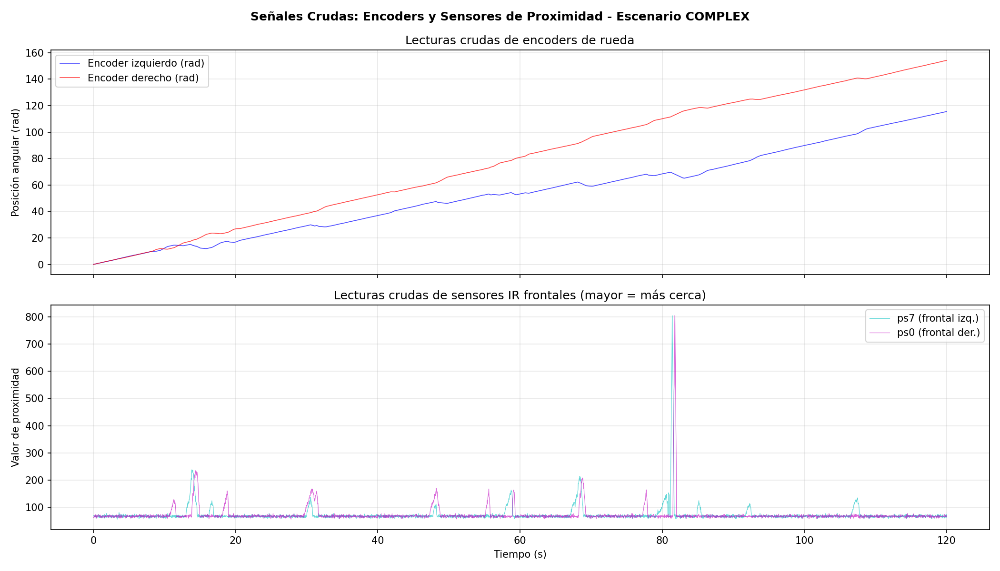

# Laboratorio 1: Simulación de un Robot Móvil Diferencial en Webots

## Descripción

Simulación de un robot móvil diferencial (**e-puck**) en **Webots** para comprender su cinemática. El controlador ejecuta secuencialmente una serie de experimentos que demuestran cómo las velocidades de las ruedas determinan la trayectoria del robot.

### Modelo Cinemático

```
v = (vr + vl) / 2        # velocidad lineal
ω = (vr - vl) / L        # velocidad angular
```

Donde `vr` y `vl` son las velocidades de las ruedas derecha e izquierda, y `L` es la distancia entre ruedas.

## Cómo Ejecutar la Simulación

1. **Instalar Webots** desde [cyberbotics.com](https://cyberbotics.com/)
2. **Abrir Webots**
3. Ir a `File → Open World...`
4. Seleccionar el archivo `worlds/laboratorio1.wbt`
5. La simulación iniciará automáticamente, ejecutando todos los experimentos en secuencia
6. Observar la consola de Webots para ver las descripciones de cada fase

## Experimentos y Resultados

### Experimento 1: Movimiento Recto (`vr = vl = 3.0`)

El robot avanza en **línea recta**. Ambas ruedas giran a la misma velocidad, por lo que `ω = 0` y no hay giro.

### Experimento 2: Trayectoria Curva (`vl = 2.0, vr = 4.0`)

El robot sigue una **trayectoria curva** hacia la izquierda. La rueda derecha gira más rápido que la izquierda, causando un giro con `ω > 0`.

### Experimento 3: Rotación en el Lugar (`vl = -3.0, vr = 3.0`)

El robot **gira sobre sí mismo** sin desplazarse. Las ruedas giran en sentidos opuestos, `v = 0` y `ω` es máximo.

### Extensión: Perturbaciones en los Actuadores

Se modifica de forma aleatoria la velocidad en cada iteración añadiendo ruido a un movimiento recto base (`v = 3.0`). Al comparar con la trayectoria ideal, se observa una _trayectoria con variaciones_, donde el robot experimenta constantes desviaciones.

### Desafío 1: Círculo

Manteniendo una diferencia constante entre las velocidades de las ruedas durante un tiempo prolongado, el robot traza un **círculo completo**.

### Desafío 2 (Opcional): Figura en 8

Dos círculos completos concatenados en **direcciones opuestas** con una velocidad tangencial forman el 8 (uno girando hacia la izquierda y otro hacia la derecha).

## Video Demostrativo

En el siguiente video se muestra la ejecución completa de la simulación, incluyendo todos los experimentos y desafíos:

[](video/lab1_demo.mp4)

> El video se encuentra en la carpeta `video/` del repositorio.

## Preguntas de Análisis

**1. ¿Qué ocurre cuando ambas ruedas tienen la misma velocidad?**
El robot se mueve en **línea recta**, ya que la velocidad angular es cero (ω = 0).

**2. ¿Cómo cambia la trayectoria cuando las velocidades son diferentes?**
El robot describe una **trayectoria curva**. Gira hacia el lado de la rueda más lenta. A mayor diferencia de velocidades, menor es el radio de curvatura.

**3. ¿Qué ocurre cuando una rueda gira en sentido opuesto a la otra?**
El robot **rota sobre su propio eje** sin desplazarse linealmente (v = 0), ya que las velocidades se cancelan.

**4. ¿Qué tipo de movimiento permite dibujar un círculo?**
Un movimiento con **velocidades diferentes pero constantes** en ambas ruedas. Esto produce una velocidad angular constante que traza una circunferencia.

## Estructura del Proyecto

```
Robotica/
├── README.md
├── .gitignore
├── worlds/
│   └── laboratorio1.wbt
├── controllers/
│   └── lab1_controller/
│       └── lab1_controller.py
└── video/                ← video demostrativo de la simulación
```

## Herramientas

- **Webots** — Simulador de robots
- **Python** — Lenguaje del controlador

---

# Laboratorio 2: Navegación Reactiva con Filtrado y Fusión de Sensores

## Integrantes

| Nombre | Rol |
|--------|-----|
| [Nombre 1] | [Desarrollo del controlador / Análisis / etc.] |
| [Nombre 2] | [Desarrollo del controlador / Análisis / etc.] |

## Objetivo

Implementar un sistema de navegación reactiva para el robot **e-puck** en Webots,
utilizando sensores de distancia y encoders de rueda, aplicando filtrado sobre
las mediciones y empleando un **filtro de Kalman** escalar para estimar la
distancia frontal a obstáculos y mejorar la toma de decisiones.

## Descripción

Sistema de navegación reactiva para el robot **e-puck** en Webots, utilizando
sensores de distancia y encoders de rueda. Se implementa un **filtro de Kalman**
escalar para estimar la distancia frontal al obstáculo más cercano, combinando
la predicción por movimiento (encoders) con la corrección por medición
(sensores frontales).

## Sensores utilizados

| Sensor               | Dispositivo Webots       | Función                                  |
|----------------------|--------------------------|------------------------------------------|
| Frontal izquierdo    | `ps7`                    | Medir obstáculos al frente               |
| Frontal derecho      | `ps0`                    | Medir obstáculos al frente               |
| Lateral izquierdo    | `ps5`                    | Decidir dirección de giro                |
| Lateral derecho      | `ps2`                    | Decidir dirección de giro                |
| Encoder izquierdo    | `left wheel sensor`      | Estimar desplazamiento lineal            |
| Encoder derecho      | `right wheel sensor`     | Estimar desplazamiento lineal            |

## Esquema de estimación (Filtro de Kalman escalar)

### Variable a estimar
`d_k`: distancia frontal al obstáculo más cercano en el instante k.

### Etapa de predicción
```
d̂_k⁻ = d̂_{k-1} - Δs_k
P_k⁻ = P_{k-1} + Q
```
Donde `Δs_k` es el avance lineal estimado desde los encoders:
`Δs = (Δθ_L · r + Δθ_R · r) / 2`

### Etapa de corrección
```
K_k = P_k⁻ / (P_k⁻ + R)
d̂_k = d̂_k⁻ + K_k · (z_k - d̂_k⁻)
P_k = (1 - K_k) · P_k⁻
```
Donde `z_k` es la medición del sensor frontal (`min(ps0, ps7)`).

### Parámetros
- `R = 0.0005` — Varianza de la medición (ruido del sensor)
- `Q = 0.0001` — Varianza del proceso (incertidumbre del modelo)

## Lógica de navegación reactiva

```
if z_frontal < CRITICAL_DISTANCE (0.008 m):   # Emergencia: sensor crudo
    GIRAR (usando sensores laterales)
elif d̂_k > SAFE_DISTANCE (0.04 m)
     AND filtered > SAFE_DISTANCE:             # Kalman + filtro: vía libre
    AVANZAR recto
else:                                         # Obstáculo detectado
    GIRAR (usando sensores laterales)
```

> **Nota:** Los sensores IR del e-puck retornan valores de proximidad (mayor = más
> cerca), no distancia en metros. Se convierte internamente usando la lookup table
> del sensor: `distancia = 0.05 × (1 - valor/1024)`. El robot avanza **solo** si
> tanto la estimación Kalman como la señal filtrada indican vía libre, evitando
> colisiones por retardo del filtro. Además, se usa *innovation gating*: si la
> diferencia entre medición y predicción supera 10 cm, el Kalman se resetea
> confiando directamente en la medición.

## Frecuencia de muestreo

- `Ts = 32 ms` (TIME_STEP)
- `fs = 31.25 Hz`
- Duración de simulación: 120 s (~3750 muestras)

## Escenarios de prueba

### Escenario Simple (`worlds/laboratorio2.wbt`)
**Slalom de Precisión** — Arena 1×1 m con **4 pilares en formación rombo**
(rojo, azul, verde, violeta). El robot parte desde x=-0.42 mirando hacia +X
y debe esquivar cada pilar con correcciones suaves de trayectoria.

Esquema del recorrido esperado:
```
Salida  ●        ● Pilar 3 (verde)
         \      /
          \    /
   Pilar 1 ●  ● Pilar 4 (violeta) → Meta
          /    \
         /      \
        ●        ● Pilar 2 (azul)
    Robot
```
Este diseño evalúa precisión de evitación en espacio abierto con
obstáculos puntuales. Ideal para comparar señal cruda vs Kalman.

### Escenario Complejo (`worlds/laboratorio2_complex.wbt`)
**Laberinto Progresivo** — Arena 1×1 m con **3 zonas de dificultad creciente**
y obstáculos **desplazados del centro** para guiar al robot, no bloquearlo:

| Zona | x | Ancho | Obstáculos | Guía |
|------|---|-------|------------|------|
| Zona 1 | -0.44 a -0.10 | 24 cm | Pilar amarillo (r=2 cm, desplazado a y=+0.04) | Paso libre por la izquierda |
| Zona 2 | -0.10 a 0.22 | 18 cm | Caja azul (izq) + caja roja (der) | Zigzag alternado |
| Zona 3 | 0.22 a 0.44 | 14 cm | Pared de cierre violeta + pilar verde de salida | Giro forzado al final |

La pared superior es fija a y=+0.12 en todo el recorrido. La pared inferior
se eleva gradualmente (y=-0.12 → -0.09 → -0.07) estrechando el corredor.
El pilar de la Zona 1 está descentrado para dar un camino claro de 8 cm,
evitando bloqueos. Este diseño permite analizar:
- **Adaptación del Kalman** al estrechamiento progresivo
- **Estabilidad** en espacios cada vez más confinados
- **Efectividad de la fusión sensorial** bajo estrés creciente

### Análisis comparativo entre escenarios
Para cada escenario se debe evaluar:
- **Estabilidad del movimiento**: qué tan suave es la trayectoria
- **Cantidad de giros innecesarios**: frecuencia de cambios de dirección
- **Capacidad para evitar colisiones**: si el robot choca o roza obstáculos
- **Diferencias entre mediciones**: cruda vs filtrada vs Kalman

## Cómo ejecutar

1. Abrir Webots
2. **Escenario simple**: `File → Open World...` → `worlds/laboratorio2.wbt`
3. **Escenario complejo**: `File → Open World...` → `worlds/laboratorio2_complex.wbt`
4. La simulación ejecuta la navegación reactiva automáticamente (120 s)
5. Los datos se guardan como `lab2_data_simple.csv` o `lab2_data_complex.csv`

## Análisis de resultados

Después de ejecutar AMBAS simulaciones, generar los gráficos:

```bash
cd controllers/lab2_controller

# Analizar ambos escenarios
python3 plot_lab2.py

# O uno específico
python3 plot_lab2.py simple
python3 plot_lab2.py complex
```

Para cada escenario se generan 5 gráficos con prefijo `simple_` o `complex_`:
- `{escenario}_comparacion_senales.png` — Señal cruda, filtrada y Kalman
- `{escenario}_superposicion_senales.png` — Las tres señales superpuestas
- `{escenario}_ganancia_kalman.png` — Evolución de la ganancia K
- `{escenario}_laterales_y_desplazamiento.png` — Sensores laterales y Δs
- `{escenario}_encoders_y_sensores_crudos.png` — Encoders crudos y sensores IR crudos

## Análisis de las señales registradas

> **Nota:** Esta sección debe completarse después de ejecutar las simulaciones.

### Señal cruda de los sensores frontales

[Describir el comportamiento observado: nivel de ruido, variabilidad,
cómo responde la señal cuando el robot se acerca a un obstáculo, etc.]

### Señal con filtro exponencial (α = 0.3)

[Comparar con la señal cruda: reducción de ruido, suavizado,
retardo introducido por el filtro, etc.]

### Estimación con filtro de Kalman

[Analizar cómo el Kalman combina la predicción (encoders) con la
medición (sensores). Describir la evolución de la ganancia K:
cuándo confía más en la predicción y cuándo en la medición.]

### Desplazamiento estimado desde encoders

[Relación s = rθ utilizada. Precisión de la estimación de avance.
Posibles fuentes de error: deslizamiento, resolución de encoders.]

## Gráficos

> **Nota:** Después de ejecutar `plot_lab2.py`, reemplazar estas
> referencias con las imágenes generadas.

### Escenario Simple

| Gráfico | Descripción |
|---------|-------------|
|  | Señal cruda, filtrada y Kalman |
|  | Superposición de las tres señales |
|  | Evolución de la ganancia K |
|  | Sensores laterales y Δs |
|  | Encoders y sensores crudos |

### Escenario Complejo

| Gráfico | Descripción |
|---------|-------------|
|  | Señal cruda, filtrada y Kalman |
|  | Superposición de las tres señales |
|  | Evolución de la ganancia K |
|  | Sensores laterales y Δs |
|  | Encoders y sensores crudos |

## Resultados en los escenarios de prueba

> **Nota:** Completar tras ejecutar ambas simulaciones y analizar los CSV.

### Escenario Simple

| Métrica | Observación |
|---------|-------------|
| Estabilidad del movimiento | [Describir] |
| Giros innecesarios | [Cantidad y frecuencia] |
| Evitación de colisiones | [¿Chocó? ¿Rozó obstáculos?] |
| Acciones registradas | [FORWARD: N, TURN_LEFT: N, TURN_RIGHT: N] |

### Escenario Complejo

| Métrica | Observación |
|---------|-------------|
| Estabilidad del movimiento | [Describir en pasillo estrecho] |
| Giros innecesarios | [Cantidad y frecuencia] |
| Evitación de colisiones | [¿Logró navegar el pasillo? ¿Chocó?] |
| Acciones registradas | [FORWARD: N, TURN_LEFT: N, TURN_RIGHT: N] |

### Comparación entre escenarios

[Diferencias clave en el comportamiento del robot:
- ¿En cuál escenario hubo más giros?
- ¿Cómo cambió la ganancia de Kalman entre escenarios?
- ¿En cuál escenario fue más crítica la fusión sensorial?]

## Conclusiones

> **Nota:** Completar con el análisis final del grupo.

[Responder aquí:
1. ¿Qué ventajas ofrece el filtro de Kalman frente a usar solo
   la señal cruda o solo el filtro exponencial?
2. ¿Cómo afecta el entorno (simple vs complejo) al desempeño
   de la navegación reactiva?
3. ¿Qué limitaciones se observaron en la implementación?
4. ¿Qué mejoras se podrían hacer al sistema?]

## Estructura del Proyecto (completa)

```
Robotica/
├── README.md
├── worlds/
│   ├── laboratorio1.wbt
│   ├── laboratorio2.wbt              ← Escenario SIMPLE
│   └── laboratorio2_complex.wbt      ← Escenario COMPLEJO
├── controllers/
│   ├── lab1_controller/
│   │   └── lab1_controller.py
│   └── lab2_controller/
│       ├── lab2_controller.py
│       └── plot_lab2.py
└── video/
```
